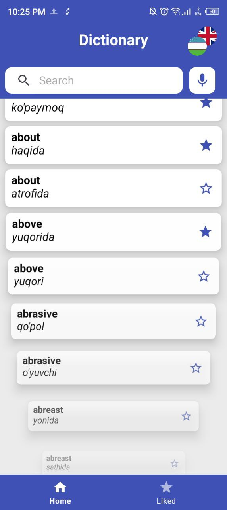
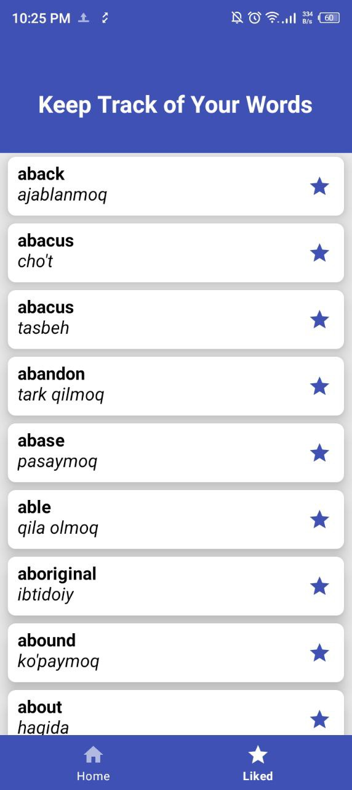
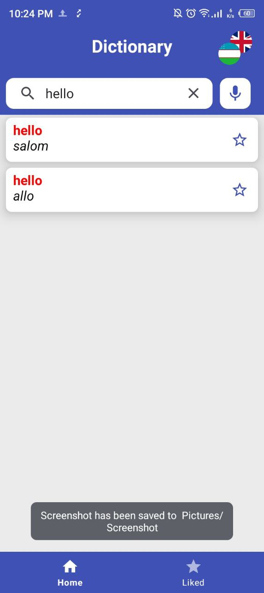
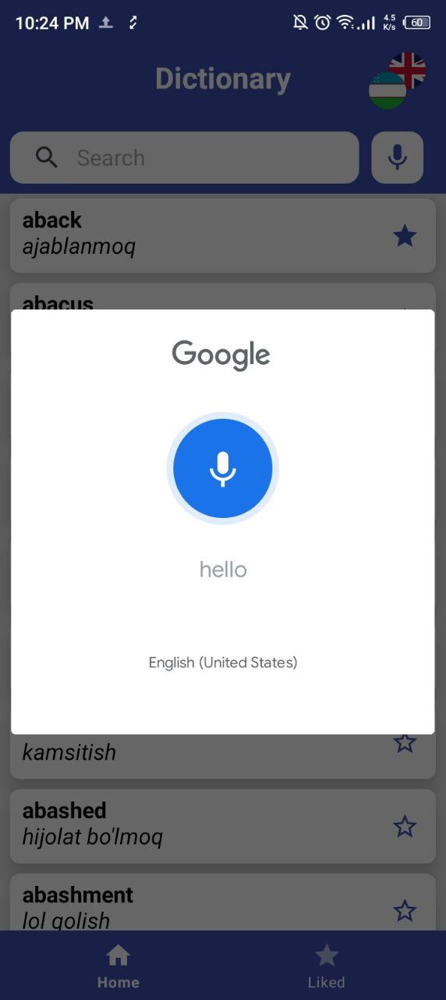
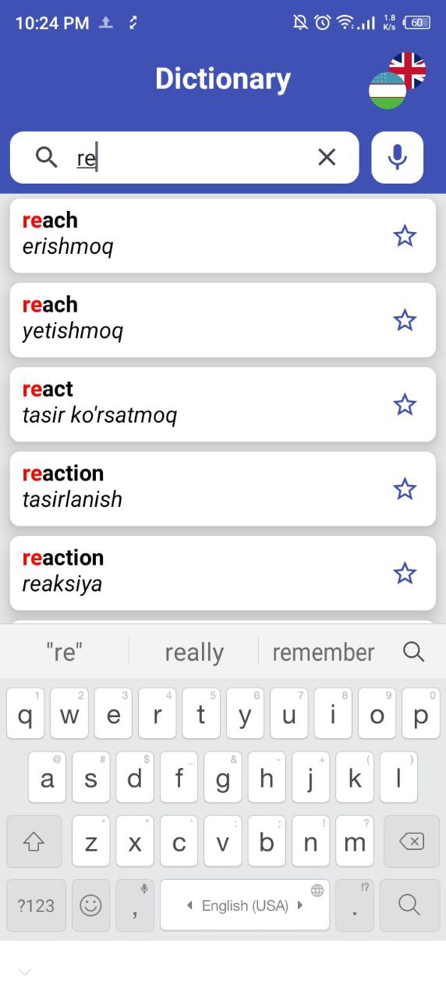
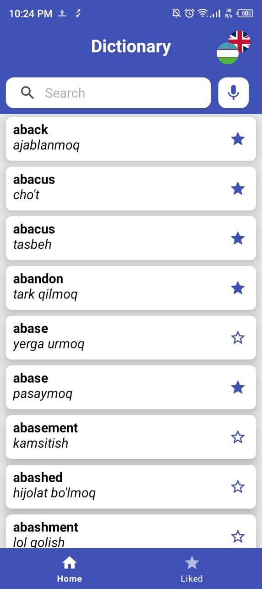

# English-Uzbek Dictionary (Android)

Welcome to the English-Uzbek Dictionary app repository! This app is a dictionary that allows users to translate words between English and Uzbek. It is built using native Android technologies and offers various useful features for users looking to expand their language skills.

---

### 📱 App Overview

The English-Uzbek Dictionary provides quick and accurate translations between English and Uzbek. The app includes voice functionality for text-to-speech and speech-to-text, making it a more interactive and accessible tool for users. It also uses a room database to store and manage user data, allowing for easy navigation through the app using fragments.

---

### ⚙️ Technologies Used

- **Android**: The app is developed using native Android technologies.
- **Fragment with Navigation Component**: Used to navigate between different parts of the app smoothly.
- **Room**: A persistence library that provides an abstraction layer over SQLite for local data storage.
- **Text to Speech (TTS)**: Allows the app to read out the translated text in a spoken format.
- **Speech to Text (STT)**: Enables users to speak words and have them transcribed to text for translation.
- **Cursor Adapter**: Used for efficiently displaying data in a list or grid format.

---

### 🖼️ Screenshots

<table>
  <tr>
    <td></td>
    <td></td>
    <td></td>
  </tr>
  <tr>
    <td></td>
    <td></td>
    <td></td>
  </tr>
</table>

---